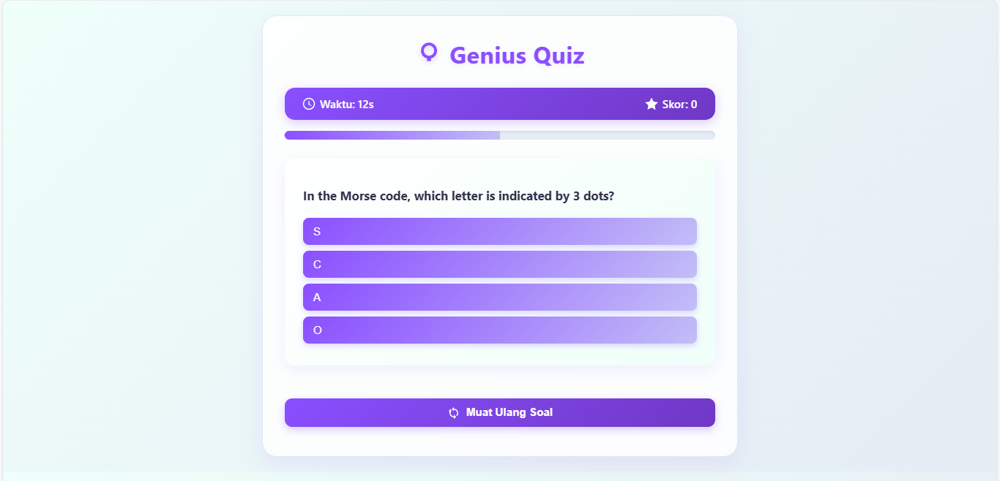
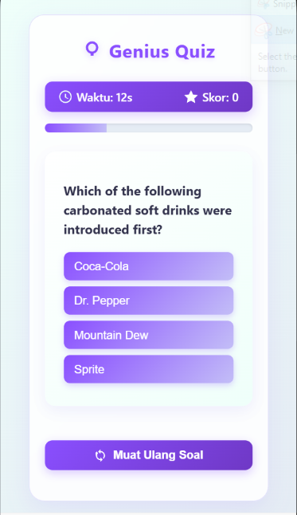

# 🧠 Genius Quiz App  
> A modern, interactive quiz web app built with **React JS**, featuring real-time score tracking, countdown timer, smooth transitions, and a clean minimalist UI with purple gradient theme.

---

## ✨ Features

✅ **Dynamic Quiz System** – Fetches questions from [Open Trivia DB API](https://opentdb.com/).  
✅ **Smart Local Cache** – Automatically saves quiz data to `localStorage` for faster reloads.  
✅ **Real-Time Timer** – Each question includes a live countdown timer.  
✅ **Responsive Design** – Fully optimized for both desktop and mobile devices.  
✅ **Sticky Header Bar** – Timer & score remain visible at all times.  
✅ **Modern UI/UX** – Smooth gradient palette, SVG icons, and glassmorphism card design.  
✅ **Animated Loading Screen** – Professional spinner animation while fetching questions.  
✅ **Reload Quiz Instantly** – Regenerate a new quiz with one click.

---

## 🖼️ Preview

### 💻 Desktop View  


### 📱 Mobile View  


> *The purple gradient theme was inspired by the color palette:*  
> `["#ffffff", "#effffa", "#e5ecf4", "#c3bef7", "#8a4fff"]`

---

## 🧩 Project Structure

```
react-quiz-app/
│
├── src/
│   ├── components/
│   │   ├── Quiz.js
│   │   ├── QuestionCard.js
│   │   ├── ProgressBar.js
│   │
│   ├── App.js
│   ├── App.css
│   ├── index.js
│
├── public/
│   ├── index.html
│
├── package.json
└── README.md
```

---

## 🚀 Getting Started

### 1️⃣ Clone the repository
```bash
git clone https://github.com/usamahdhaqi/quiz-app.git
cd quiz-app
```

### 2️⃣ Install dependencies
```bash
npm install
```

### 3️⃣ Run the app
```bash
npm start
```

### 4️⃣ Build for production
```bash
npm run build
```

---

## 🎨 UI Design Highlights

| Component | Description |
|------------|--------------|
| **Header Bar** | Sticky gradient bar that displays timer ⏱ and score ⭐ side-by-side |
| **Question Card** | Glassmorphism style card with reversed diagonal gradient and hover effects |
| **Buttons** | Soft gradient hover with subtle elevation transitions |
| **Progress Bar** | Animated purple gradient showing quiz progress |
| **Loading Screen** | Circular animated spinner with glowing edges |
| **Reload Button** | Gradient teal button to regenerate new quiz instantly |

---

## ⚙️ Technologies Used

- **React JS (Hooks & Functional Components)**  
- **CSS3 (Flexbox + Glassmorphism + Gradient Design)**  
- **JavaScript (ES6)**  
- **Open Trivia DB API**  
- **LocalStorage API**

---

## 🧠 Quiz Flow Overview

1. Fetch 10 random multiple-choice questions from Open Trivia API.  
2. Display one question at a time with countdown timer (default: 15s).  
3. User selects an answer → auto-advance to next question.  
4. Score is updated instantly.  
5. Once all questions are answered, show final result summary.  
6. “Reload” button regenerates new questions instantly.

---

## 🧵 Color Palette

| Name | Hex Code | Usage |
|------|-----------|--------|
| White | `#ffffff` | Base background |
| Mint White | `#effffa` | Card & accent backgrounds |
| Soft Blue | `#e5ecf4` | Secondary background |
| Soft Purple | `#c3bef7` | Button & gradient blend |
| Deep Purple | `#8a4fff` | Primary brand color |

---

## 🧩 Example Components

### ProgressBar.js
```jsx
<div className="progress-bar">
  <div className="fill" style={{ width: `${percent}%` }}></div>
</div>
```

### QuestionCard.js
```jsx
<div className="question-card">
  <h3 dangerouslySetInnerHTML={{ __html: data.question }} />
  {answers.map((ans, idx) => (
    <button key={idx} onClick={() => onAnswer(ans === data.correct_answer)}>
      {ans}
    </button>
  ))}
</div>
```

---

## 🧑‍🎨 Design Philosophy

> “Simplicity, clarity, and focus.”  
Every element in the Genius Quiz App was designed to minimize distraction and maximize engagement.  
The layout uses **central alignment, soft gradients, SVG-based icons,** and a **subtle depth hierarchy** to keep users immersed.

---

## 📦 Future Enhancements

- ✅ Add category & difficulty selection menu  
- ✅ Add sound effects for correct/wrong answers  
- ✅ Add result analytics (accuracy & time per question)  
- ✅ Dark mode toggle  
- ✅ Leaderboard integration using Firebase or Supabase  

---

## 🧰 License

This project is released under the **MIT License** — free to use, modify, and distribute.  
See the [LICENSE](./LICENSE) file for more details.

---

## 💜 Credits

Created with passion by [Your Name](https://github.com/usamahdhaqi)  
Design inspired by minimal UI trends and soft pastel gradients ✨  

> *If you like this project, please give it a ⭐ on GitHub — it really helps!*
